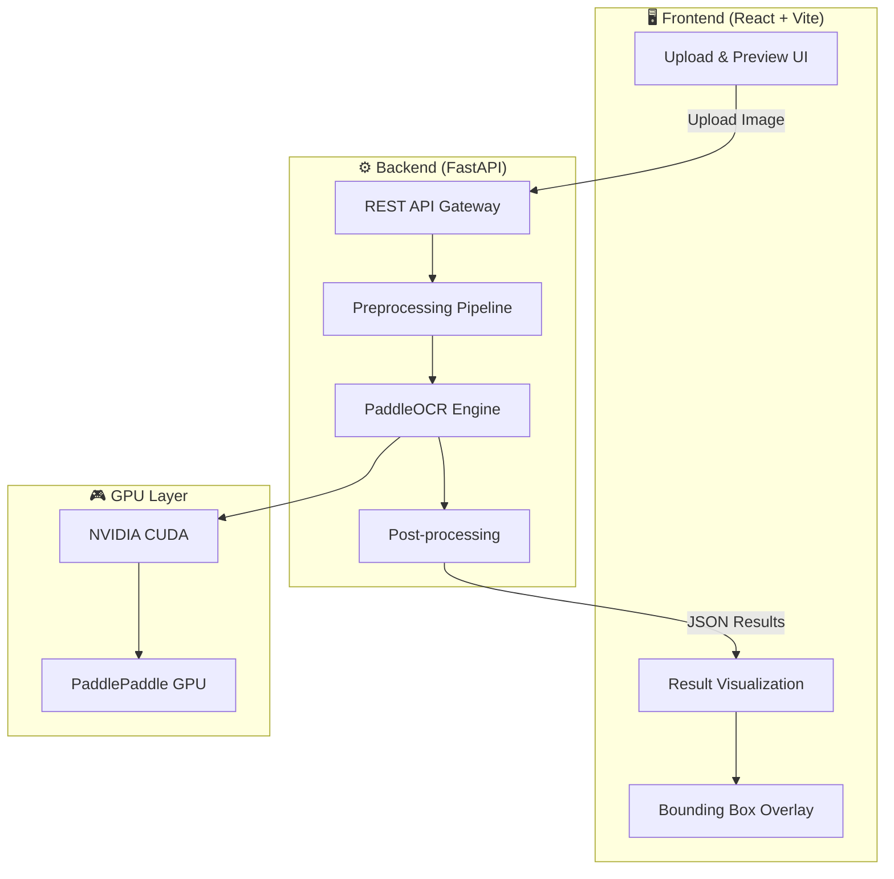
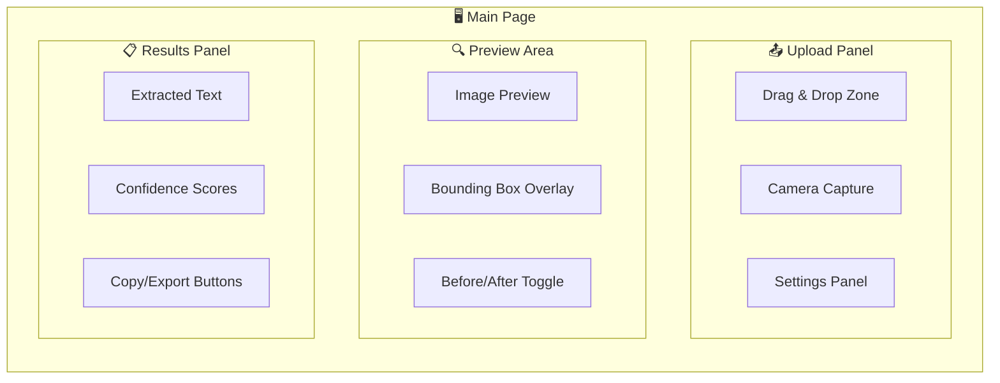

# ScanCode-OCR: Metal Surface OCR Web Application

Web application đọc text trên bề mặt kim loại sử dụng **PaddleOCR PP-OCRv5** + **OpenCV preprocessing** + **FastAPI** backend + **React/Vite** frontend.

---

## System Architecture



---

## User Review Required

> [!IMPORTANT]
> **Python Environment:** Project hiện tại dùng Python 3.7.3. Plan này sẽ tạo **virtual environment mới** với Python ≥ 3.8 (khuyến nghị 3.10+). Venv cũ trong `ocr/` sẽ không bị xóa nhưng sẽ không được sử dụng.

> [!IMPORTANT]
> **Frontend Framework:** Plan sử dụng **React + Vite + TypeScript** với vanilla CSS (không Tailwind). Nếu bạn muốn dùng stack khác, hãy cho biết.

> [!WARNING]
> **CUDA Version:** Cần xác nhận phiên bản CUDA trên máy bạn (`nvcc --version`) để cài đúng `paddlepaddle-gpu`. Plan giả định **CUDA 11.8 hoặc 12.x**.

---

## Project Structure

```
scancode-ocr/
├── backend/                          # FastAPI Backend
│   ├── app/
│   │   ├── __init__.py
│   │   ├── main.py                   # FastAPI app entry point
│   │   ├── config.py                 # Configuration & settings
│   │   ├── models/
│   │   │   ├── __init__.py
│   │   │   └── schemas.py            # Pydantic request/response models
│   │   ├── api/
│   │   │   ├── __init__.py
│   │   │   └── routes.py             # API endpoints
│   │   ├── core/
│   │   │   ├── __init__.py
│   │   │   ├── ocr_engine.py         # PaddleOCR singleton wrapper
│   │   │   ├── preprocessor.py       # OpenCV preprocessing pipeline
│   │   │   └── postprocessor.py      # Regex cleanup & validation
│   │   └── utils/
│   │       ├── __init__.py
│   │       └── image_utils.py        # Image I/O helpers
│   ├── tests/
│   │   ├── __init__.py
│   │   ├── test_preprocessor.py
│   │   ├── test_ocr_engine.py
│   │   └── test_api.py
│   ├── sample_images/                # Test images cho development
│   ├── requirements.txt
│   └── run.py                        # Script khởi động server
│
├── frontend/                         # React + Vite Frontend
│   ├── public/
│   ├── src/
│   │   ├── assets/
│   │   │   └── styles/
│   │   │       ├── index.css         # Global styles & design tokens
│   │   │       ├── upload.css        # Upload component styles
│   │   │       └── results.css       # Results display styles
│   │   ├── components/
│   │   │   ├── Header.tsx
│   │   │   ├── ImageUpload.tsx       # Drag & drop + file picker
│   │   │   ├── PreprocessPreview.tsx  # Before/After preprocessing
│   │   │   ├── OcrResults.tsx        # Text results + confidence
│   │   │   ├── BoundingBoxOverlay.tsx # SVG overlay on image
│   │   │   └── SettingsPanel.tsx     # Preprocessing parameters
│   │   ├── hooks/
│   │   │   └── useOcr.ts            # Custom hook for OCR API
│   │   ├── services/
│   │   │   └── api.ts               # API client
│   │   ├── types/
│   │   │   └── index.ts             # TypeScript types
│   │   ├── App.tsx
│   │   └── main.tsx
│   ├── index.html
│   ├── package.json
│   ├── tsconfig.json
│   └── vite.config.ts
│
├── .gitignore
└── README.md
```

---

## Proposed Changes

### Component 1: Backend — Preprocessing Pipeline

Đây là phần **quan trọng nhất** của hệ thống. Pipeline xử lý ảnh kim loại trước khi đưa vào OCR engine.

#### [NEW] [preprocessor.py](file:///d:/Code/project/scancode-ocr/backend/app/core/preprocessor.py)

Pipeline preprocessing bao gồm **6 bước chính**, có thể bật/tắt từng bước qua API:

| Bước | Kỹ thuật | Mục đích |
|:---|:---|:---|
| 1 | **Grayscale Conversion** | Loại bỏ color noise |
| 2 | **CLAHE** (clipLimit=2.0, tileGrid=8×8) | Tăng contrast cục bộ cho bề mặt chiếu sáng không đều |
| 3 | **Noise Reduction** (Median Blur / Gaussian Blur) | Loại bỏ grain, vết xước, brush marks |
| 4 | **Morphological Operations** (Top-Hat / Black-Hat / Closing) | Tách text khỏi nền — tùy loại text |
| 5 | **Adaptive Thresholding** (Gaussian, blockSize=11) | Binarize cho bề mặt sáng không đều |
| 6 | **Final Cleanup** (Dilation + Erosion) | Kết nối nét đứt, loại bỏ noise nhỏ |

**Chiến lược theo loại text trên kim loại:**

```python
class MetalTextType(Enum):
    ENGRAVED = "engraved"       # Khắc chìm — dùng Black-Hat
    STAMPED = "stamped"         # Dập nổi — dùng Top-Hat  
    DOT_PEEN = "dot_peen"       # Chấm điểm — Closing đặc biệt để nối dots
    LASER_ETCHED = "laser_etched" # Khắc laser — High-pass filter
    AUTO = "auto"               # Tự động detect
```

- **Engraved text (khắc chìm):** Dùng **Black-Hat morphology** để tách chữ tối trên nền sáng
- **Stamped text (dập nổi):** Dùng **Top-Hat morphology** để tách chữ sáng trên nền tối
- **Dot-peen (chấm điểm):** Dùng **morphological Closing** với kernel lớn (7×7) để nối các dots thành nét liền, sau đó **Dilation** nhẹ
- **Laser etching:** Dùng **high-pass filter** (Laplacian / Sobel) để tách cạnh khắc
- **Auto mode:** Phân tích histogram + edge density để tự chọn chiến lược

---

### Component 2: Backend — OCR Engine

#### [NEW] [ocr_engine.py](file:///d:/Code/project/scancode-ocr/backend/app/core/ocr_engine.py)

Wrapper singleton cho PaddleOCR với GPU acceleration:

```python
class OcrEngine:
    """Singleton PaddleOCR wrapper — load model 1 lần, tái sử dụng cho mọi request"""
    
    _instance = None
    
    def __init__(self):
        # Khởi tạo PaddleOCR PP-OCRv5 với GPU
        self.ocr = PaddleOCR(
            use_angle_cls=True,   # Phát hiện text xoay
            lang='en',            # Default English, có thể đổi
            use_gpu=True,
            det_model_dir=None,   # Dùng model mặc định PP-OCRv5
            rec_model_dir=None,
            show_log=False
        )
    
    def recognize(self, image: np.ndarray) -> List[OcrResult]:
        """Chạy OCR trên ảnh đã preprocessing"""
        # Trả về: text, confidence, bounding_box
```

**Key features:**
- **Singleton pattern** — model chỉ load 1 lần khi server start
- **Multi-language support** — `en`, `ru`, `ch`, `japan`, `korean`, etc.
- **Angle classification** — phát hiện và xoay text bị nghiêng
- **Batch processing** — xử lý nhiều ảnh cùng lúc (cho use case factory)

---

### Component 3: Backend — Post-processing

#### [NEW] [postprocessor.py](file:///d:/Code/project/scancode-ocr/backend/app/core/postprocessor.py)

Làm sạch kết quả OCR:

- **Regex validation:** Kiểm tra format serial number, mã sản phẩm (configurable patterns)
- **Confidence filtering:** Loại bỏ kết quả có confidence < threshold (mặc định 0.6)
- **Character correction:** Sửa lỗi phổ biến trên kim loại (O↔0, I↔1, S↔5, B↔8)
- **De-duplication:** Loại bỏ text trùng lặp từ overlapping detection boxes
- **Sorting:** Sắp xếp kết quả theo vị trí (top-to-bottom, left-to-right)

---

### Component 4: Backend — API Layer

#### [NEW] [routes.py](file:///d:/Code/project/scancode-ocr/backend/app/api/routes.py)

```
POST /api/ocr/scan              — Upload ảnh → nhận kết quả OCR
POST /api/ocr/batch             — Upload nhiều ảnh
POST /api/ocr/preprocess-preview — Xem ảnh sau preprocessing (debug)
GET  /api/ocr/languages         — Danh sách ngôn ngữ hỗ trợ
GET  /api/health                — Health check
```

**Request schema cho `/api/ocr/scan`:**
```json
{
    "image": "<file upload>",
    "metal_type": "auto|engraved|stamped|dot_peen|laser_etched",
    "language": "en",
    "confidence_threshold": 0.6,
    "preprocessing": {
        "clahe_clip_limit": 2.0,
        "blur_kernel_size": 3,
        "adaptive_block_size": 11,
        "enable_morphology": true
    }
}
```

**Response schema:**
```json
{
    "success": true,
    "results": [
        {
            "text": "SN-20240315-A7B3",
            "confidence": 0.95,
            "bounding_box": [[x1,y1], [x2,y2], [x3,y3], [x4,y4]],
            "position": {"x": 120, "y": 45}
        }
    ],
    "metadata": {
        "processing_time_ms": 342,
        "metal_type_detected": "engraved",
        "image_size": [1920, 1080],
        "preprocessing_applied": ["clahe", "median_blur", "black_hat", "adaptive_threshold"]
    },
    "preprocessed_image_base64": "..."  // Optional, khi debug
}
```

#### [NEW] [schemas.py](file:///d:/Code/project/scancode-ocr/backend/app/models/schemas.py)

Pydantic models cho tất cả request/response types.

#### [NEW] [main.py](file:///d:/Code/project/scancode-ocr/backend/app/main.py)

FastAPI app với:
- CORS middleware (cho phép frontend gọi API)
- Startup event: load PaddleOCR model vào memory
- Static file serving cho preprocessed images
- Error handling middleware

#### [NEW] [config.py](file:///d:/Code/project/scancode-ocr/backend/app/config.py)

Pydantic Settings cho environment variables:
- `CUDA_VISIBLE_DEVICES`
- `OCR_LANGUAGE`
- `MAX_IMAGE_SIZE`
- `CONFIDENCE_THRESHOLD`

---

### Component 5: Frontend — React Web App

#### [NEW] Frontend project (Vite + React + TypeScript)

Giao diện bao gồm **3 khu vực chính:**



##### UI Design:
- **Dark theme** với glassmorphism effects
- **Color palette:** Deep navy (#0F172A) → Electric blue (#3B82F6) → Cyan accent (#06B6D4)
- **Typography:** Inter font family
- **Micro-animations:** Upload progress, scan line effect khi processing, fade-in results
- **Responsive:** Desktop-first, hỗ trợ tablet

##### Core Components:

| Component | Mô tả |
|:---|:---|
| `ImageUpload.tsx` | Drag & drop zone + file picker + camera capture, validate file type/size |
| `PreprocessPreview.tsx` | Slider so sánh Before/After preprocessing |
| `BoundingBoxOverlay.tsx` | SVG overlay hiển thị bounding boxes trên ảnh gốc, hover để highlight text |
| `OcrResults.tsx` | Bảng kết quả với text, confidence bar, copy button per-line |
| `SettingsPanel.tsx` | Tùy chỉnh metal type, language, preprocessing parameters |
| `Header.tsx` | Logo, title, theme toggle |

---

### Component 6: Dependencies & Configuration

#### [NEW] [requirements.txt](file:///d:/Code/project/scancode-ocr/backend/requirements.txt)

```
paddlepaddle-gpu>=3.0.0
paddleocr>=2.9.0
fastapi>=0.115.0
uvicorn[standard]>=0.30.0
python-multipart>=0.0.9
opencv-python-headless>=4.9.0
numpy>=1.24.0
Pillow>=10.0.0
pydantic>=2.0.0
pydantic-settings>=2.0.0
```

#### [MODIFY] [.gitignore](file:///d:/Code/project/scancode-ocr/.gitignore)

Thêm:
```
__pycache__/
*.pyc
.env
venv/
node_modules/
dist/
backend/sample_images/
```

#### [MODIFY] [README.md](file:///d:/Code/project/scancode-ocr/README.md)

Viết lại hoàn chỉnh với:
- Project description
- Architecture diagram
- Setup instructions (Backend + Frontend)
- API documentation
- Usage guide
- Contributing guide

---

## Development Phases

### Phase 1: Backend Core (ưu tiên cao nhất)
1. Setup Python venv mới (≥ 3.10)
2. Cài đặt dependencies (paddlepaddle-gpu, opencv, fastapi)
3. Implement `preprocessor.py` — pipeline xử lý ảnh
4. Implement `ocr_engine.py` — PaddleOCR wrapper
5. Implement `postprocessor.py` — cleanup kết quả
6. Implement `routes.py` + `main.py` — API endpoints
7. Test với sample images

### Phase 2: Frontend
1. Init Vite + React + TypeScript project
2. Build design system (CSS tokens, dark theme)
3. Implement `ImageUpload` component
4. Implement `OcrResults` + `BoundingBoxOverlay`
5. Implement `PreprocessPreview` (Before/After)
6. Implement `SettingsPanel`
7. Connect frontend → backend API

### Phase 3: Polish & Optimize
1. Error handling toàn diện
2. Loading states & animations
3. Batch processing UI
4. Export kết quả (CSV, JSON, clipboard)
5. Performance optimization

---

## Open Questions

> [!IMPORTANT]
> **1. CUDA Version:** Bạn đang dùng CUDA version nào? Chạy `nvcc --version` để kiểm tra. Điều này quyết định package `paddlepaddle-gpu` nào sẽ được cài.

> [!IMPORTANT]
> **2. Python Version:** Bạn có Python ≥ 3.10 trên máy không? Nếu chỉ có 3.7.3, cần cài thêm.

> [!NOTE]
> **3. Ngôn ngữ OCR mặc định:** Default sẽ là English (`en`). Bạn cần hỗ trợ thêm ngôn ngữ nào? (ví dụ: Tiếng Nga `ru` — như trong `check_env.py` hiện tại)

> [!NOTE]
> **4. Camera capture:** Bạn có muốn tích hợp chụp ảnh trực tiếp từ webcam/camera trên web app không? Hay chỉ cần upload file?

> [!NOTE]
> **5. Batch processing:** Bạn có cần xử lý hàng loạt (upload nhiều ảnh cùng lúc) ngay từ đầu không? Hay thêm sau?

---

## Verification Plan

### Automated Tests
```bash
# Backend unit tests
cd backend && python -m pytest tests/ -v

# Test preprocessing pipeline với sample images  
python -m pytest tests/test_preprocessor.py -v

# Test API endpoints
python -m pytest tests/test_api.py -v

# Frontend build check
cd frontend && npm run build
```

### Manual Verification
1. Khởi động backend: `cd backend && python run.py`
2. Khởi động frontend: `cd frontend && npm run dev`
3. Upload ảnh test cho từng loại metal text:
   - Ảnh chữ khắc (engraved)
   - Ảnh chữ dập (stamped)
   - Ảnh dot-peen marking
   - Ảnh laser etching
4. Kiểm tra bounding boxes hiển thị đúng vị trí
5. Kiểm tra accuracy và confidence scores
6. Test preprocessing preview (before/after)

### Browser Testing
- Sử dụng browser subagent để verify UI renders correctly
- Test drag & drop upload
- Test responsive layout
